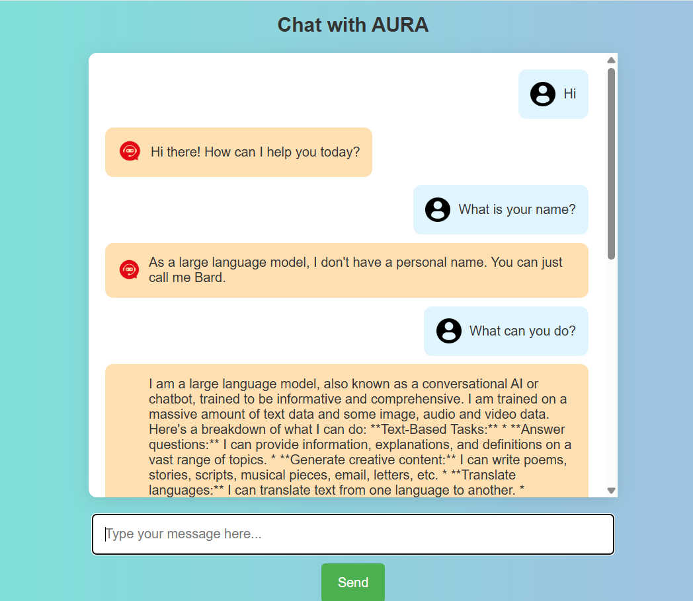

# Aura Chatbot

Aura Chatbot is a web-based AI chatbot application built with Java and Spring Boot. It leverages the Google Gemini generative language API to provide intelligent conversational responses. The chatbot features a simple and clean web interface for users to interact with the AI in real-time.

## ChatBot Interface



## Features

- Interactive chat interface with user and bot messages
- Integration with Google Gemini API for AI-generated responses
- Responsive and user-friendly UI built with HTML, CSS, and JavaScript
- Spring Boot backend handling API requests and serving the frontend

## Prerequisites

- Java 17 or higher
- Maven 3.6+
- A valid Google Gemini API key

## Getting Started

1. Clone the repository:

   ```bash
   git clone <repository-url>
   cd <repository-directory>
   ```

2. Configure your Google Gemini API key in `src/main/resources/application.properties`:

   ```
   gemini.api.key=YOUR_API_KEY_HERE
   ```

3. Build and run the application using Maven:

   ```bash
   mvn spring-boot:run
   ```

4. Open your browser and navigate to:

   ```
   http://localhost:8080/
   ```

5. Start chatting with Aura!

## Project Structure

- `src/main/java/com/aura/AuraChatbotApplication.java` - Main Spring Boot application class
- `src/main/java/com/aura/controller/ChatbotController.java` - Handles web requests and chat API endpoints
- `src/main/java/com/aura/service/GeminiApiService.java` - Service layer integrating with Google Gemini API
- `src/main/resources/templates/index.html` - Frontend chat UI template
- `src/main/resources/static/images/` - Static images used in the chat UI

## Usage

Type your message in the input box and press Enter or click the Send button. The chatbot will respond with AI-generated replies powered by the Gemini API.

## License

This project is licensed under the MIT License.

## Contact

For any questions or feedback, please contact [Your Name] at [your.email@example.com].
